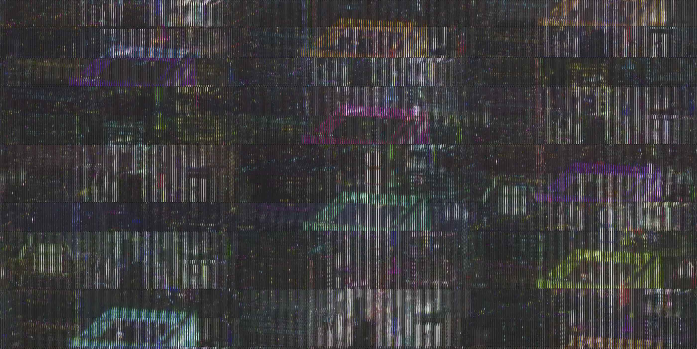

Batch Image Pixel Sorting & more
===

###make_video.sh###
Frames need to be extracted from input video the first time the Processing code will be run.
To do so, uncomment the first two lines from the bash script.

###TO DO###
* Live input mode where sorting parameters are controlled through MIDI input
* Use shaders instead
* Make operations state-based rather than stateless
* Audio-Reactive (Max/MSP?)
* Alter Image should work the same irrespective of image dimensions
* Make this into a separate module that can be incorporated with the Force Attraction Pen.

Hattip to @jprctr for the base pixel sorting code.

###Inspirations###
* Sabrina Ratté's [video](https://www.youtube.com/watch?v=EEmgEAp8hSI) for Tim Hecker's Black Refraction.

